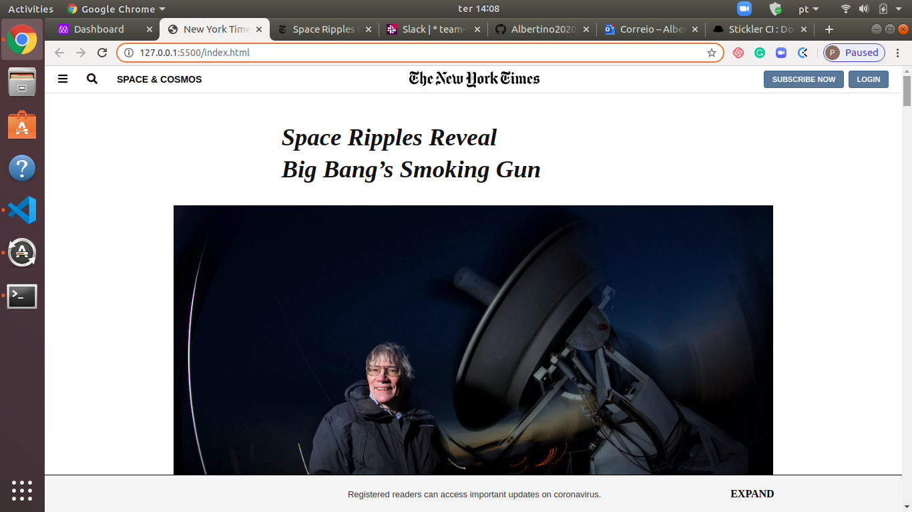

# New YOrk Times Web Page Clone

> This is the third project from the Microverse Main Curriculum. Wee carried out a cloning of the New York Time Page, using HTML and CSS code, trying as much as possible to match the original page. Some minor configurations were not considered and the links basically go no-where.

None.

## Built With

- HTML
- CSS
- VSL, GIT, GitHub

## Live Demo

[Live Demo Link](https://rawcdn.githack.com/Albertino2020/NYT-clone/c0000b855d3a6cf734566e75f479dc7b25254931/index.html)

## Getting Started

**This is an example of how you may give instructions on setting up your project locally.**
**Modify this file to match your project, remove sections that don't apply. For example: delete the testing section if the currect project doesn't require testing.**

To get a local copy up and running follow these simple example steps.

### Prerequisites

### Setup

### Install

### Usage

### Run tests

### Deployment

## Authors

👤 **Author1**

- Github: [@githubhandle](https://github.com/githubhandle)
- Twitter: [@twitterhandle](https://twitter.com/twitterhandle)
- Linkedin: [linkedin](https://linkedin.com/linkedinhandle)

👤 **Author2**

- Github: [@githubhandle](https://github.com/githubhandle)
- Twitter: [@twitterhandle](https://twitter.com/twitterhandle)
- Linkedin: [linkedin](https://linkedin.com/linkedinhandle)

## 🤝 Contributing

Contributions, issues and feature requests are welcome!

Feel free to check the [issues page](issues/).

## Show your support

Give a ⭐️ if you like this project!

## Acknowledgments

- Hat tip to anyone whose code was used
- Inspiration
- etc

## 📝 License

This project is [MIT](lic.url) licensed.
